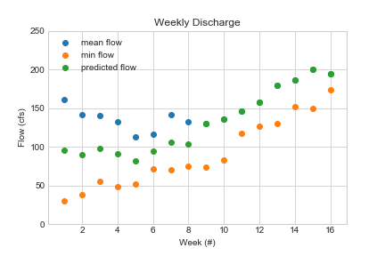
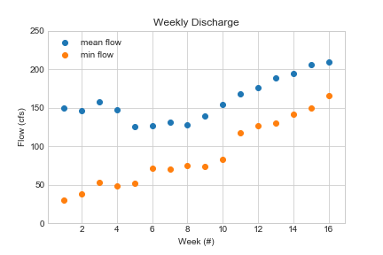

# HW Assignment #3 (Forcasting)
##### By: Jacob Ridlinghafer
###### 9/14/2020

To create my predictions I made a list of flow values for each week by first creating an empty list for that week then appendending values from a range of days in the month, I also controlled the list values by limiting the upper bound of flows to be 600 cfs as to mitigate large spikes and because this year has been extremely dry, and is predicted to be dryer this winter as well. Then I created a new list with the mean, the minimum, and standard deviations of each weeks values. I plotted the minimums and mean by week with all the years data, pre-2000, and post 2010. The first thing to note is that the gap is much larger between the average and minimum, along with larger standard deviations in the first 8 weeks of the 16 week period. So, I thought using the average flow for the first 8 weeks would be too high as the weeks leading up to the start of the semster had lower flow than normal. This lead me to make a new list that is the mid-point between the mean and minimum and applied this to the first 8 weeks of the list and the last 8 weeks using the average since the standard deviation is not as great. For a low flow year like this year I decided the post-2010 data was the best representation of this year, so that was used for my submitted forcast values (Figure 1).

As, for my two-week forcast I first looked at the weather forcast to see if I should include potential spikes in flow rate, and saw that the weather will be dry and mostly sunny. So I created my boundary around this, I made a list of all values between 30 and 60 cfs for week 1 (9/13-9/19) and week 2 (9/20-9/26) and found the means, which had low standard deviations. I chose the 30 and 60 cfs boundary condition based on what flows had been prior to saturday, I found the lowest values to be around 30-35 cfs and the highest to be closer to 55-60. The final mean values found for week 1 & 2 were 51.75 & 54.06 respectively.

1. Describe the variables flow, year, month, and day. What type of objects are they, what are they composed of, and how long are they?
The variables flow, year, month, and day are lists composed of integers that occupy a specific index value (ie. position in list). All of the above lists have exactly 11577 index entries.
2. How many times was the daily flow greater than your prediction in the month of September (express your answer in terms of the total number of times and as a percentage)?
week 1 daily flow is greater 153 times or 70.5% of the time
week 2 daily flow is greater 142 times or 65.4% of the time
week 3 daily flow is greater 146 times or 67.3% of the time
week 4 daily flow is greater 173 times or 79.7% of the time
3. How would your answer to the previous question change if you considered only daily flows in or before 2000? Same question for the flows in or after the year 2010? (again report total number of times and percentage)
Pre-2000
week 1 daily flow is greater 117 times or 53.9% of the time
week 2 daily flow is greater 127 times or 58.5% of the time
week 3 daily flow is greater 109 times or 50.2% of the time
week 4 daily flow is greater 118 times or 54.4% of the time
Post-2010
week 1 daily flow is greater 159 times or 73.3% of the time
week 2 daily flow is greater 156 times or 71.9% of the time
week 3 daily flow is greater 163 times or 75.1% of the time
week 4 daily flow is greater 194 times or 89.4% of the time

4. How does the daily flow generally change from the first half of September to the second?
In all, pre-2000, and post-2010 the average flow rate of the first two weeks of September is larger than that of the last 2 weeks (see Figure 2 weeks 2-5)

