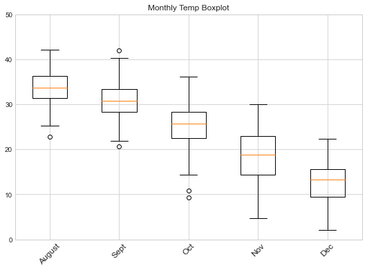

# HW Assignment #12 (Forcasting)
##### By: Jacob Ridlinghafer
###### 11/16/2020

## Grade
3/3 - nice job 

Figure 1: Box plot that that shows temperatures for months August - December (2015- 2020)

#Questions

1. A brief summary of the how you chose to generate your forecast this week.

I decided to go with the linear regressive model again

2. A description of the dataset you added

What is the dataset? Why did you choose it?

I chose to use an NCEP max surface temperature dataset (2015- 2020). I picked this dataset because changes in temperature can affect evapotranspiration.

What is the spatial and temporal resolution and extent of the data ?

The data set is global scale I chose to zoom in however to be able to retrieve more data.

Where did you get the data from?

NCEP data archives

What was your approach to extracting and aggregating it into something useful to you?

I made it into dataframes and then combined all of my relevant parameters into one dataframe that I could manipulate at will.

3. A plot of the dataset you added. This can be a timeseries, map, histogram or any other plot that you think is a good summary of what you added.

See figure 1.
