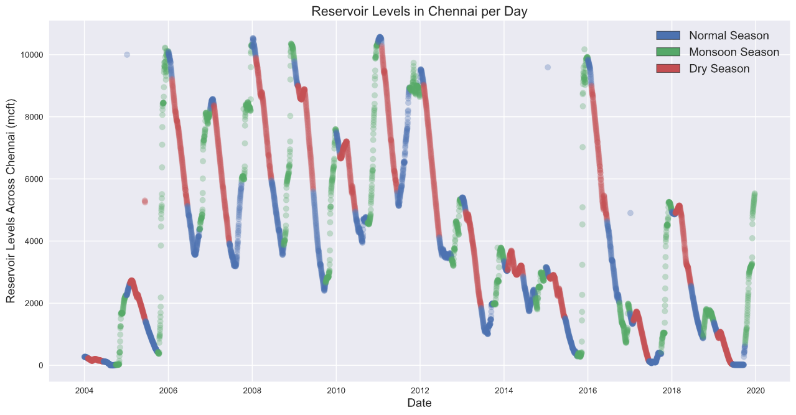

# HW Assignment #14
##### By: Jacob Ridlinghafer
###### 11/30/2020

#Questions

1. What is the paper or project you picked? Include a title, a link the the paper and a 1-2 sentence summary of what its about.

I initially looked for research article using python but was unable to find something using python or the foratting of the site wa foreign to me. So, I decided to use a data science platform one of my data science friends recommended a few months prior called kaggle the project is called Chennai Water Management which is a series of 63 notebooks from different authors https://www.kaggle.com/sudalairajkumar/chennai-water-management. This project had three goals (1) Visualize the water need / usage of the city (2) Identify whether the water sources availability will be able to meet water needs. (3) define the current water crisis compared to previous years? The notebook I tried to duplicate is https://www.kaggle.com/markxavier/chennai-water-management-exploratory-analysis. This series of notebooks described that Chennai the capital of the Indian state of Tamil Nadu, is facing an acute water shortage due to shortage of rainfall for the past three years. The notebook I chose graphically analyses water levels in the resivoir and compares it to rainfall.

2. What codes and/or data are associated with this paper? Provide any link to the codes and datasets and a 1-2 sentence summary of what was included with the paper (i.e. was it a github repo? A python package?A database? Where was it stored and how?)

This was stored directly on the links above they are jupyter notebooks stored on the website then at the end there is a section dedicated to relevant inputs for the model (i.e. csv files)

3. Summarize your experience trying to understand the repo: Was their readme helpful? How was their organization? What about documentation within the code itself?

The python notebook was written essentially how we wrote our last assignment it described what they were doing how the code worked and what they saw from observations.

4. Summarize your experience trying to work with their repo: What happened? Where you successful? Why or why not?

It was extremely easy to duplicate their findings because the code was right next to the graphs it produced, relied on packages I already had, and only required 2 csv files. I did some digging into some of the other projects and it seems that some people are protective of their code or wanted it to flow more like a paper and ommitted code from their respective notebooks

5. Summarize your experience working with the data associated with this research. Could you access the data? Where was it? Did it have a DOI? What format was it in?

The experience was easy and not very time consuming the dataframes they produced were easy to understand and well labeled I could have easily produced some of the graphs they made if I desired.

6. Did this experience teach you anything about your own repo or projects? Things you might start or stop doing?

I would say don't underestimate the power of describing code and how it works and if I made a github repo I would make sure the repo folders were well labeled I came across one github repo that was a rabbit hole hunt for a python file that I couldn't find also it didn't say what language their code was using in the code availability statement, so I don't know if I would have ever found it.

Here is my favorite graph I was able to reproduce from this notebook!

