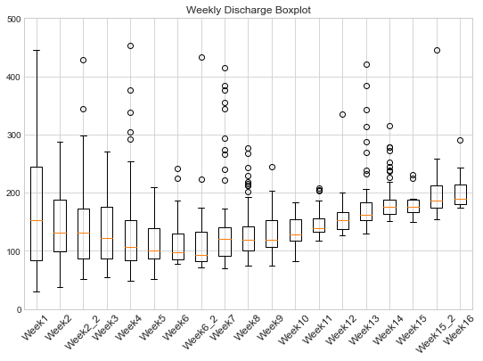
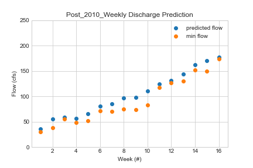
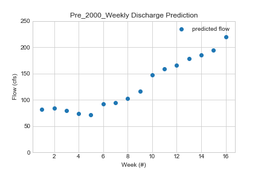

# HW Assignment #4 (Forcasting)
##### By: Jacob Ridlinghafer
###### 9/21/2020

___
### Grade
3/3 - Great work, I really like your boxplots!
___

To create my predictions I made a array of flow values for each week by first filtering for flow values that happened that week in history. The first thing I did with this data was made a series of box and whisker plots for each week to see where flow was centered each week (Figure 1). I noted prior to the start of the semester the flow values were between 30-50cfs which is extremely low so I took the 5th percent quantile to be my starting point once the whiskers became small around week 5 (figure 1) I made it the 12.5th percentile because I hope it will be a little wetter. combining these values over time led me to creating a 16 week forcast for all years, pre-2000, and post-2010 values. I decided that the best fit was the post-2010 model (figure 2) because it started off relatively close to the average we were seeing pre- august 21st this year.

Figure 1: Weekly box plot for 2010+ years (cfs)

Figure 2: Predicted flow (blue) vs min flow (orange) as a function of time post-2010

As, for my two-week forcast I looked at how the average flow (for all years) compared to this years average flow for the weeks leading up to 9/21. I did this by dividing the average of the prior weeks in 2020 by the average in the past with the same time frame I found the fraction two fractions one for weeks of higher flow (flow ~> 170cfs) and low flow (flow ~< 170cfs) the high flow fraction was 0.228 and a low flow fraction of 0.349. I multiplied the average for next week (197.9 cfs) by high flow fraction and the 2nd weeks average (138.2 cfs) by the low flow fration which resulted in the prediction of 45.2 cfs and 48.2 cfs respectively.

1. Include discussion of the quantitative analysis that lead to your prediction. This can include any analysis you complete but must include at least two histograms and some quantitative discussion of flow quantiles that helped you make your decision.
I used box plots for my analysis which are esentially upturned histograms but shows alot more information such as the min, median, max, outliers, and the 25th and 75th percentile. From this analysis of (figure 1) I figured I would select a percentile close to 0 for the first 5 weeks and at 6 weeks and after the lower part of the whisker is so negligable it wouldn't make too much of a difference but I decided to go with 12.5th percentile as to bbe between the min and the lower portion of the box.
2.Describe the variable flow_data, What is it, What type of values is is composed of, What is are its dimensions, and total size?
Flow data is an array that is composed of Year, Month, Day, Flow rate in order of column. It is in essence a matrix 4 by how many measurements have been taken rows (11585 1 per day). It is a 4 by 11585 matrix  with a total size of 46340.
3. How many times was the daily flow greater than your prediction in the month of September (express your answer in terms of the total number of times and as a percentage)?
week 1 daily flow is greater 206 times or 94.9% of the time
week 2 daily flow is greater 206 times or 94.9% of the time
week 3 daily flow is greater 206 times or 94.9% of the time
week 4 daily flow is greater 206 times or 94.9% of the time
it's the same because I used the 5th percentile
4. How would your answer to the previous question change if you considered only daily flows in or before 2000? Same question for the flows in or after the year 2010? (again report total number of times and percentage)

Pre-2000
week 1 daily flow is greater 84 times or 100% of the time
week 2 daily flow is greater 84 times or 100% of the time
week 3 daily flow is greater 84 times or 100% of the time
week 4 daily flow is greater 79 times or 94.0% of the time

Post-2010
week 1 daily flow is greater 67 times or 95.7% of the time
week 2 daily flow is greater 64 times or 91.4% of the time
week 3 daily flow is greater 65 times or 92.9% of the time
week 4 daily flow is greater 64 times or 91.4% of the time
descrepancies could have arised from using a < opperator instead of <=

5. How does the daily flow generally change from the first half of September to the second?
In all years and post-2010 the predicted flow rate increases as a function of time (see Figure 2 weeks 2-5) but the counter example is pre-2000 where it decreases at this point (see Figure 3 weeks 2-5)

Figure 3: Predicted flow (blue) vs min flow (orange) as a function of time pre-2000

