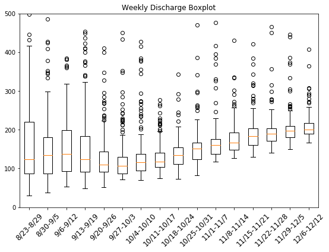
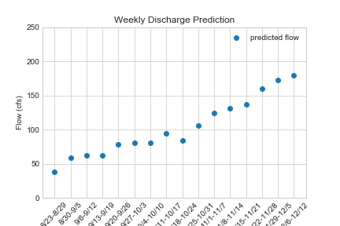

# HW Assignment #5 (Forcasting)
##### By: Jacob Ridlinghafer
###### 9/28/2020

__
## Grade
3/3 - Great work again! Love your graphs. We are going to work more on plotting this week.

Note - I'm having some trouble seeing your graphs correctly in the Markdown preview. None of them show up in Atom and only some show up online.  Can you try using the atom plugin listed in the homework instead? 
__

First I created a weekly boxplot distribution containing all data for those weeks(Figure 1), this seemed too broad to me so I analysed the yearly changes in a new data frame (yearly) from june - august 21st  because the summer is the part most affecting this drought. I grouped these by flow and described by year (code: x=yearly.groupby('year')['flow'].describe()). I found while looking at the table that I could use 2011-2019 but would rather not use data in 2017 and 2019 because they either had too high of a mean or a great standard deviation. I plotted weekly data using these years in a box plot (Figure 2) and saw that the data looks more uniform and compact at a lower flow value. The means of all these years was much too high because we are in a drought so I decided to find a mean quantile # that matched the mean 2020 flow for this period (june - august 21st). I found x3=yearly.groupby('year')['flow'].quantile(0.11).mean() to be extremely close to the mean of 47 cfs. so applied this to every week in the time period and got a nice looking plot that see Figure 3 that matches initially the flows of 40-60 cfs that we saw leading up to the first week of the semester in 2020.

Figure 1: Weekly box plot for all years (cfs)

Figure 2: Weekly box plots for using years 2011-2019 years (2017 and 2018 were ommited because of unpredictable data)

Figure 3: Weekly prediction using 2011-2019 at the 11 % quantile of those weeks data (2017 and 2018 were ommited because of unpredictable data)

As, for my two-week forcast I utilized the same technique but I had a month extra data so I shifted my data to match that and ommitted June and instead used the period from (august - september 26th). This one was tricky though because no quantile number matched the mean 2020 flow so I useed the lowest I could 0 and found the percent error of quantile 0 and the mean 2020 flow. I found that 1- decimal-percent error to be ~ 0.915 and multiplied this by my 1 week and 2 week quantiles to get 65.57 & 63.93 respectively for my week 1 and 2 forecasts.

1. Provide a summary of the data frames properties.
What are the column names?
first is 'flow', 'year', 'month', 'day' and 'datetime' we also have 'agency_cd', 'site_no', and 'code' which were not utilised.
What is its index?
index is the position that python recognizes as starting at 0, each index location is specified as a reading on a specific date.
What data types do each of the columns have?

2. Provide a summary of the flow column including the min, mean, max, standard deviation and quartiles.

3. Provide the same information but on a monthly basis. (Note: you should be able to do this with one or two lines of code)

4. Provide a table with the 5 highest and 5 lowest flow values for the period of record. Include the date, month and flow values in your summary.
5 highest:

5 lowest:

5. Find the highest and lowest flow values for every month of the year (i.e. you will find 12 maxes and 12 mins) and report back what year these occurred in.

max (months 1-12)

min (months 1-12)

Provide a list of historical dates with flows that are within 10% of your week 1 forecast value. If there are none than increase the %10 window until you have at least one other value and report the date and the new window you used

... the table goes on but would take up too much space length is 90 values (5% above and 5% below)
