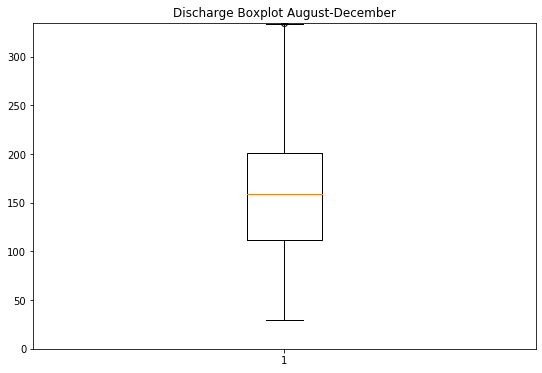
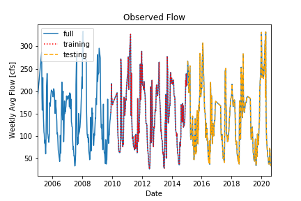
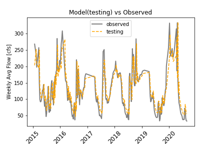
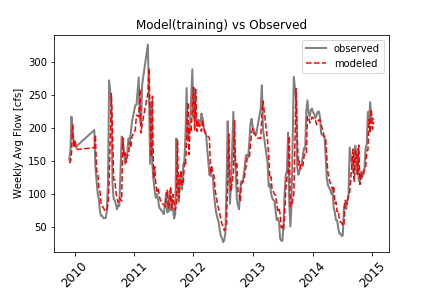
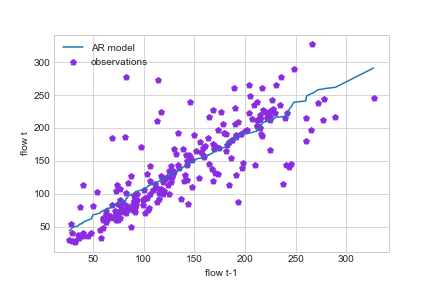
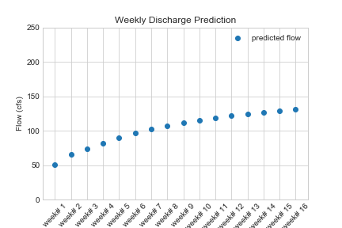

# HW Assignment #6 (Forcasting)
##### By: Jacob Ridlinghafer
###### 10/5/2020

___
### Grade
3/3 - great work, very thorough analysis and nice graphs!

___

First, I created a boxplot with all data from August- December then I truncated the y axis to find the value where outliers begin I found this value to be 335 cfs (Figure 1), I decided I would find a way to ommitt this data. I found updating the flow_weekly data frame to be best and instantly the r^2 (correlation) changed from 0.47 to 0.67. Next, I created 4 time lagged series and made my training period from 2010-2015 and the testing period from 2015-present I did this to have data that are more similar to modern conditions. I also decided to make models all the way from have 1 - 4 time lagged series I found 3 to be the magic number when making my 16 week forecast with a correlation of 0.7. I then created a for loop that could project the data into the future I chose 16 but always experimented with more like 1000 and the model always converged meaning it's not an oscillating model which makes sense because at it's heart it's a linear equation. Next I created four plots the first was to show where testing, and training periods(Figure 2). The second graph was zoomed in on the training period and plotted with observed flow, the third was the same but for the testing portion (Figure 3 & 4) they both showed they followed the observed flow quite well. Fourth was the AR model compared with a scatter of t vs t-1 points it seemed to be fairly concentrated on the line (Figure 5). The last was my 16 week projection of the data into the future (Figure 6)

Figure 1: Box plot that that shows portion of graph without outliers for months August - December (all years)

Figure 2: a plot from 2005-2020 shows when training starts and when testing starts

Figure 3: zoomed in on training period with observed 2010-2015

Figure 4: zoomed in on testing period with observed 2015-2020

Figure 5: AR model t-1 v t

Figure 6: Weekly discharge prediction using linear regression

As, for my two-week forcast I utilized the same technique but, I used the four time lag series data because it shows the lowest change from a point to the next and I think it's still going to be dry.

#Questions

1. A summary of the AR model that you ended up building, including (1) what you are using as your prediction variables, (2) the final equation for your model and (3) what you used as your testing and training periods. In your discussion please include graphical outputs that support why you made the decisions you did with your model.

  The AR model I created was three lagged time series with the variables coefficient of determination: 0.7, intercept: 20.84, and slope: [ 0.89, -0.22,  0.18]. The equation was prediction = model3.intercept_ + model3.coef_[0]* week1 + model3.coef_[1]* week2 +  model3.coef_[2]* week3: week # refers to how many weeks ago that was. 3 was discussed in the above section.

2. Provide an analysis of your final model performance. This should include at least one graph that shows the historical vs predicted streamflow and some discussion of qualitatively how you think your model is good or bad.

  In Figures 3 and 4 it is seen that it wraps the observed flow nicely in both the training and testing period respectively. The problem of this model comes to light when you want to project in to the future sure it's pretty good 1 or 2 time steps into the future and ok at 20 time steps but it always converges, which is bad in an ultimately oscillating system if your trying to predict next year for instance it cant go back down when it reaches its peak. Another bad thing is that I had to get rid of outliers which makes certain time steps skip a few weeks instead of one week. Over all it's great for predicting that which you already have data for and the immediate future.

3. Finally, provide discussion on what you actually used for your forecast. Did you use your AR model, why or why not? If not how did you generate your forecast this week?

  I did use this model because I think it has potential for a 16 week forecast and especially the 2 week forecast because it has a correlation of 0.7 which is very good for a dynamic system. If this were a normal year I think the prediction would be great although it is hot and dry and likely to be a little lower (5-10 cfs) than my prediction of 67.3, and 78.2 cfs respectively.
